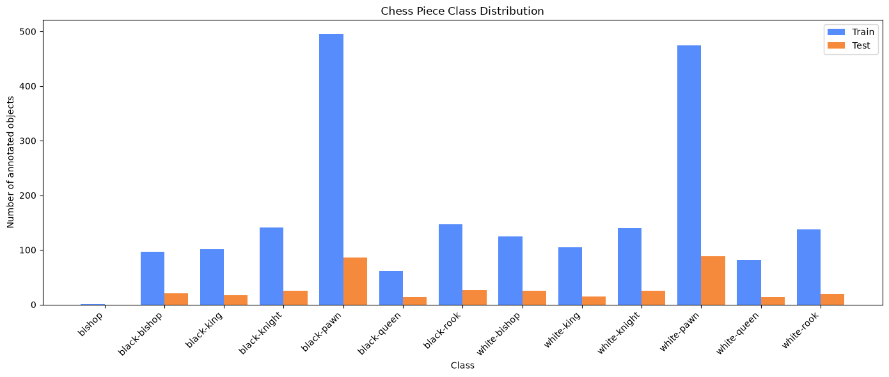
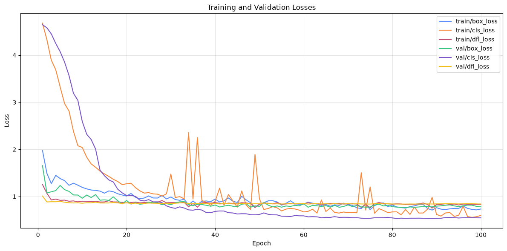
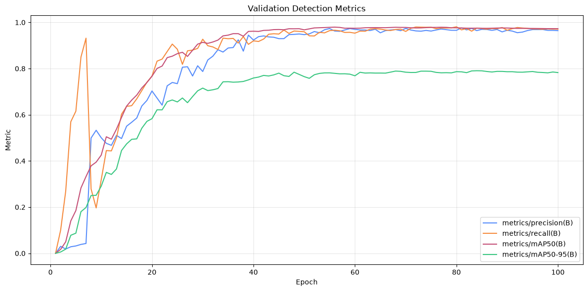
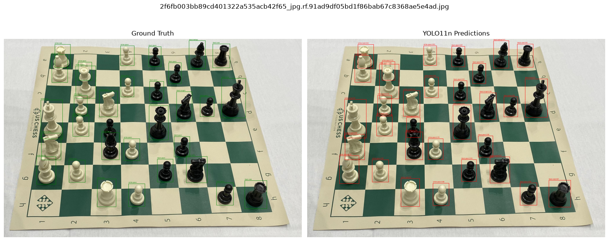
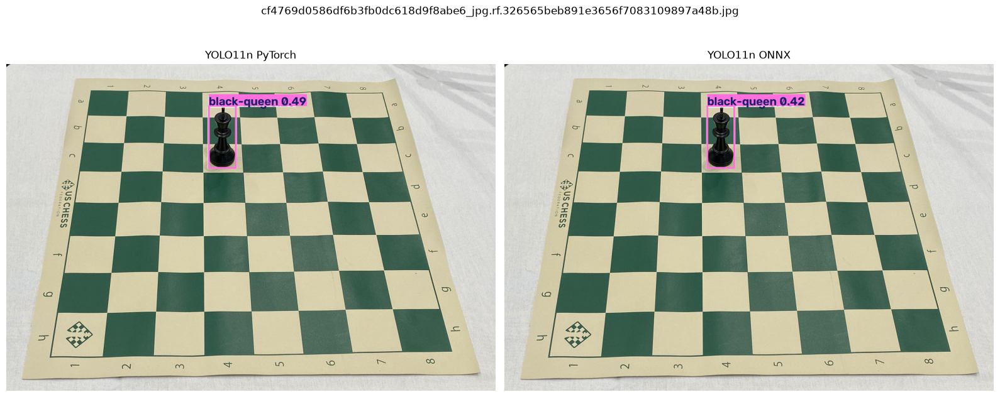

# YOLO11n Chess Piece Detection — Fine-Tuning

Fine-tuning of **YOLO11n** (Ultralytics) for chess piece detection from a top-down board image. This is the computer-vision component of **ChessQ**, a standalone chess-playing system built on an **Arduino UNO Q** (quad-core Cortex-A53, Debian Linux + STM32U585 MCU), where the exported model runs on-device to read the board state from a USB webcam. Move validation is handled by `python-chess`, move generation by Stockfish, and suggested moves are shown on the board's 12x8 RGB LED matrix.

This repository covers **only the training and export stage**: dataset preparation, fine-tuning, evaluation, and conversion to ONNX for embedded deployment.

## Dataset

[Chess Pieces Object Detection Dataset](https://universe.roboflow.com/joseph-nelson/chess-pieces-new) (Roboflow, public domain), fixed top-down viewpoint of a physical chessboard.

| | Published (Roboflow) | Downloaded / used here |
|---|---|---|
| Images | 292 | 231 (202 train, 29 test — no validation split provided) |
| Annotated objects | 2,894 | 2,484 (2,108 train, 376 test) |
| Classes | 12 (6 pieces × 2 colors) | 13 — see note below |

A validation split was carved out of the training set (80/20), giving **161 train / 41 validation / 29 test** images. The test set was never touched during training or model selection.

**Data-quality note:** `data.yaml` declares 13 classes instead of 12 — a generic `bishop` label sneaks in alongside the 12 color-specific ones, with a single occurrence in the whole training set and none in the test set. It's a labeling artifact from the source dataset rather than an intended class, called out here rather than silently ignored.



Class distribution is imbalanced — pawns dominate (as on a real board), while queens and the stray `bishop` label are rare. This was accepted as representative of the actual task rather than artificially rebalanced.

## Experimental Setup

Training and benchmarking were run locally on:

| Component | Detail |
|---|---|
| GPU | NVIDIA GeForce RTX 5090 (32 GB) |
| CPU | AMD Ryzen 9 9900X (12-core) |
| OS | Linux (Ubuntu-based) |
| Python | 3.12.3 |
| PyTorch | 2.13.0 (CUDA 13.0) |
| Ultralytics | 8.4.131 |

## Training Configuration

| Parameter | Value |
|---|---|
| Base weights | `yolo11n.pt` (COCO-pretrained) |
| Image size | 416×416 |
| Epochs | 100 (early-stop patience 20 — not triggered) |
| Batch size | 16 |
| Optimizer | auto (Ultralytics default) |
| Seed | 42 |



Box, classification, and DFL losses decrease steadily and stabilize after ~epoch 40, with a few short classification-loss spikes (batches with harder mosaics/augmentation) that recover immediately — no signs of divergence or instability.



Precision, recall and mAP@50 climb quickly and plateau above 0.95 after epoch ~50. mAP@50-95 (the stricter, localization-sensitive metric) plateaus lower, around 0.78, which is expected: it penalizes imprecise box edges that don't matter much for this use case, since the downstream pipeline only needs the *occupied square*, not a pixel-perfect box.

**Best checkpoint: epoch 84** (highest validation mAP@50-95) — Precision 0.9645, Recall 0.9755, mAP@50 0.9750, mAP@50-95 0.7907.

## Test Set Evaluation

Evaluated once, on the held-out 29-image test set, using the epoch-84 checkpoint:

| Metric | Validation | Test | Δ |
|---|---|---|---|
| Precision | 0.9645 | 0.9679 | +0.003 |
| Recall | 0.9755 | 0.9781 | +0.003 |
| mAP@50 | 0.9750 | 0.9804 | +0.005 |
| mAP@50-95 | 0.7907 | 0.8189 | +0.028 |

Test performance tracks validation closely (if anything, slightly better), which is a good sign against overfitting given how small the dataset is.

**Per-class mAP@50** is uniformly strong (0.93–1.00) across all 12 real piece classes; the weakest class is `white-pawn` (recall 0.857, mAP@50 0.928), likely due to pawns being small, numerous, and prone to mutual occlusion. The synthetic `bishop` label (1 sample) is excluded from any conclusions — too few instances to be meaningful.

### Qualitative Results

Ground truth (left) vs. predictions (right) on a cluttered mid-game position:



All pieces are detected and correctly classified, including pieces of the same type standing close together — the scenario that matters most for reading a real game in progress.

## Export & ONNX Verification

The best checkpoint was exported to **ONNX** (static shape, 416×416) for framework-independent deployment on the embedded runtime.

| Model | Size |
|---|---|
| PyTorch (`.pt`) | 5.19 MB |
| ONNX (`.onnx`) | 10.03 MB |

Before trusting the converted model, the same test image was run through both formats to check for behavioral drift introduced by the export:



Same box, same class, confidence within noise (0.49 vs 0.42) — the conversion preserves the model's behavior.

### Inference Benchmark (development machine)

| Model | Avg. inference | FPS |
|---|---|---|
| YOLO11n PyTorch (GPU) | 9.57 ms | 104.4 |
| YOLO11n ONNX Runtime | 47.77 ms | 20.9 |

On this desktop machine PyTorch's native CUDA path is unsurprisingly faster than the ONNX Runtime session here. This isn't the deployment target, though — it's a development-time sanity check. The number that actually matters is inference latency measured **on the Arduino UNO Q itself**, using ONNX Runtime configured for that platform's constraints (4 threads, sequential execution, `imgsz=320`, single-shot capture) rather than this desktop's default session settings.

## Limitations

- **Small, single-domain dataset**: 231 images from one physical board/camera/lighting setup. Real-world robustness (different boards, pieces, lighting) is untested and is the main risk to validate once the camera is mounted on the actual rig.
- **Class imbalance**: queens and bishops are underrepresented relative to pawns; performance on rare classes is measured on very few test instances.
- **mAP@50-95 ceiling (~0.79–0.82)**: acceptable here since the downstream task (mapping a detection to a board square) is far more forgiving than precise pixel-level localization.

## Repository Structure

```
.
├── YOLOv11n_Chess_Fine_Tuning.ipynb   # full pipeline: data prep → training → eval → export
├── assets/                            # plots and qualitative samples used in this README
└── README.md
```

## Deployment Target

The exported `best.onnx` model is the input artifact for the on-device inference stage of **ChessQ**, running on the Arduino UNO Q via ONNX Runtime (CPU execution provider, 4 threads). That stage — board calibration, real-time capture, and integration with `python-chess` / Stockfish — lives in the main ChessQ repository.

## References

R. Khanam and M. Hussain, *YOLOv11: An Overview of the Key Architectural Enhancements*, arXiv:2410.17725, 2024. [Paper](https://arxiv.org/abs/2410.17725)

Dataset: [Chess Pieces Object Detection Dataset](https://universe.roboflow.com/joseph-nelson/chess-pieces-new), Roboflow, public domain.